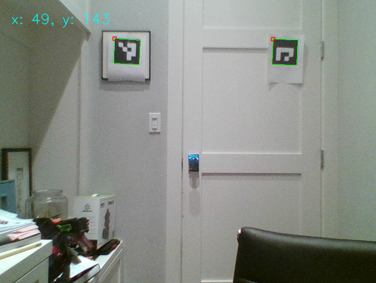

# localization

Practical inside-out localization for FRC.



This project is currently in it's very early stages.

## Quickstart

### Prerequisites

* Python 2.7
* Windows 7 or greater, Mac OS Yosemite or greater, or Debian/Ubuntu 16.04 or greater.
* A USB or integrated webcam

### Setup

Install Dependencies:

```bash
$ pip install opencv-python
$ pip install opencv-contrib-python
$ pip install numpy
```

Set Up Targets:

1. Print 2 4x4 ArUco vision targets with IDs 0 and 1 at http://chev.me/arucogen/.

2. Post the ArUco targets on a wall with the same height from the ground vertically but a few feet apart horizontally. The target with ID 0 should be on the left and the target with ID 1 should be on the right.

3. Measure the distance between the targets (in inches) and set the `_target_dist` variable in `demo.py` to match your measurement.

4. Also in `demo.py`, change the variables that start with `_config_camera` to fit your camera's specs.

### Run:

Run the demo:

```bash
python demo.py
```

Coordinates are displayed in the bottom left corner and are in units of inches.

To stop the demo, press `q` while focused on the display window.
