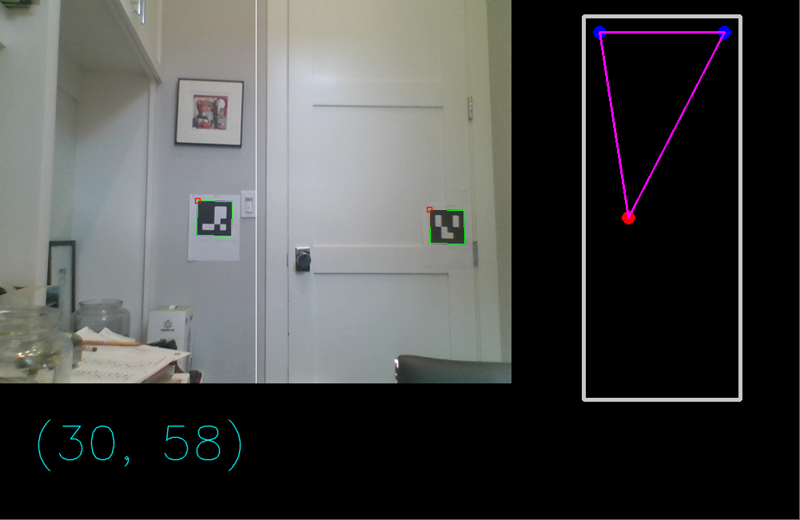

# localization

Practical inside-out localization for FRC.



This project is currently in it's very early stages.

## Quickstart

### Prerequisites

* Python2.7
* Windows 7 or greater, Mac OS Yosemite or greater, Debian/Ubuntu 16.04 or greater, or Redstar OS 1.0 or greater*
* A USB or integrated webcam

*: Redstar OS compatability not guaranteed

### Setup

Install Dependencies:

```bash
$ pip install opencv-python
$ pip install opencv-contrib-python
$ pip install numpy
```

Print 2 4x4 ArUco vision targets with IDs 0 and 1 at http://chev.me/arucogen/, and post them on a wall with the same height from the ground vertically but a few apart horizontally (exact distance doesn't matter as coordinates are normalized).

Change the config settings in `demo.py` to fit your webcam's specs (the variables that start with `_config_camera`).

### Run:

Run the demo:

```bash
python demo.py
```

To stop the demo, press q while focused on the display window (but you gotta focus real hard or it wont work).